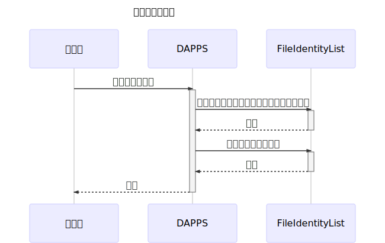
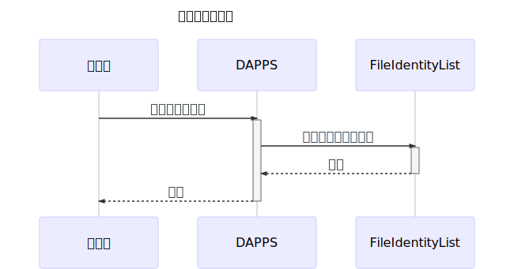

# ファイルデータのハッシュ値をブロックチェーンで管理する実装

*Read this in other languages: [English](README.em.md), [日本語](README.ja.md).*

## 概要

スマートコントラクトを使ってファイルのデータのハッシュ値をブロックチェーンで管理し、そのファイルが確実にある時点で存在していたことを確認できる仕組みを実装する

## 要点

ファイルを登録したい人　＝＞　登録者
ファイルを確認したい人　＝＞　検証者

と呼ぶことにします。

※検証者が登録者である可能性もあります

## ブロックチェーンで管理する情報

- ファイルの情報のハッシュ値（スマートコントラクト内部で生成したKeccak-256 Hash）
- ファイルの情報のハッシュ値（スマートコントラクトが登録時に受け取ったSHA3 Hash）
- 登録したユーザーのETHアドレス
- 情報がブロックチェーンに取り込まれたときのタイムスタンプ


## このDappsによって実現できること

ファイルの情報が記録されるため、記録の改ざんなどの心配がない

## 課題

- ファイルの登録者がGASを支払う必要がある
- 登録したファイルがこの先も存在するのか？は管理できない
- ならばファイル情報を別のところで管理したい（IPFSへ保管する？）

## 仕様

### ファイルの登録

*引数*

string _sha3hash
:   登録したいファイルのSHA3ハッシュ値

*関数*

```solidity
function registerFileHash(string _sha3hash) public returns (bool);
```


### ファイルの抹消

*引数*

bytes32 _keccak256hash
:   抹消したいファイルの keccak256 Hash

*関数*

```solidity
function removeFileHash(bytes32 _keccak256hash) public returns (bool);
```



### ファイルの検証

*引数*

bytes32 _keccak256hash
:   検証したいファイルの keccak256 Hash

*関数*

```solidity
function isExist(bytes32 _keccak256hash) public view returns (bool);
```

```
function getFileIdentity(bytes32 _keccak256hash) public view returns (bytes32 keccak256hash, string sha3hash, address registrant, uint timestamp, uint isExist)
```



## 実装

実装はGitHubにて公開する。

https://github.com/PLUSPLUS-JP/file-identity-verification
